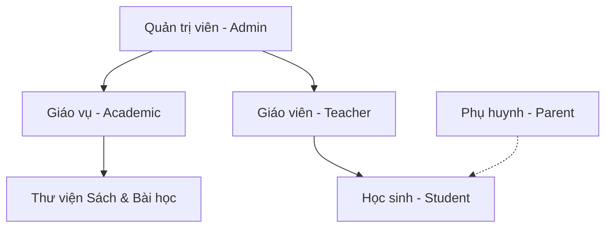

# HỆ THỐNG CỔNG THÔNG TIN HỌC TẬP THÔNG MINH EDUSMART (EDUSMART AI PORTAL)

EduSmart là một nền tảng học tập thông minh trực quan và sinh động dành cho học sinh tiểu học, được thiết kế theo Chương trình Giáo dục phổ thông (GDPT) 2018 của Việt Nam. Ứng dụng tích hợp công nghệ Trí tuệ Nhân tạo (Generative AI) để hỗ trợ soạn giáo án, đồng thời áp dụng các cơ chế trò chơi hóa (Gamification) để tăng tính tương tác và tạo hứng thú học tập cho học sinh. Nền tảng được tối ưu hóa cho cả trạng thái trực tuyến (online) và ngoại tuyến (offline).

---

## 1. Công Nghệ Áp Dụng (Technical Stack)

- **Frontend Core:** Next.js v16.2.6 (App Router) & React v19.2.4.
- **Styling & Animations:** TailwindCSS v4 & Framer Motion (hiệu ứng chuyển động mượt mà).
- **Backend & Database:** Supabase (PostgreSQL) với thiết kế tối ưu hóa chỉ mục (indexes).
- **AI Services:** 
  - `@google/genai` (Gemini API) cho việc soạn bài học thông minh và hỗ trợ gia sư ảo.
  - `openai` (OpenAI API) như một lựa chọn thay thế hoặc bổ trợ.
- **Offline Storage & Sync:** 
  - `idb-keyval` (IndexedDB) để lưu trữ đệm dữ liệu trên Client-side.
  - `syncManager` để ghi lại nhật ký thay đổi (`sync_logs`) và tự động đồng bộ lên Supabase khi có kết nối Internet trở lại.
- **Xử lý tài liệu:** `pdf-lib` dùng để phân tích và trích xuất thông tin từ sách giáo khoa dạng PDF.

---

## 2. Các Vai Trò Trong Hệ Thống (User Roles)

Hệ thống EduSmart được thiết kế phân quyền chặt chẽ với 5 vai trò người dùng cốt lõi:

### 👦 Học Sinh (Student)
Học sinh là trung tâm của hệ thống, tương tác với các tính năng thông qua giao diện trò chơi hóa đẹp mắt:
- **Bản đồ kho báu học tập (TreasureMap / Roadmaps):** Học tập theo lộ trình gồm các chặng trực quan, mở khóa từng bài học sau khi hoàn thành bài học trước đó.
- **Trình phát bài học (Lesson Player):** Trải nghiệm bài học chuẩn 5 bước sư phạm:
  1. *Khởi động (Warm-up):* Câu chuyện dẫn dắt và câu hỏi tình huống từ bạn Cú AI.
  2. *Khám phá (Explanation):* Nội dung bài học rút gọn kèm biểu tượng trực quan sinh động.
  3. *Ví dụ (Examples):* Các bài mẫu được hướng dẫn từng bước giải chi tiết.
  4. *Vận dụng (Application):* Liên hệ thực tiễn cuộc sống kèm thử thách mở rộng.
  5. *Luyện tập (Practice):* Trả lời câu hỏi trắc nghiệm, điền vào chỗ trống hoặc kéo thả.
- **Gia sư ảo Socratic AI (Socratic Tutor):** Khung chat thảo luận bài học với bạn Cú thông thái. Đặc biệt, AI tuân thủ phương pháp sư phạm Socratic (không trực tiếp giải hộ bài mà chỉ đưa ra câu hỏi gợi mở để học sinh tự suy nghĩ).
- **Công nghệ Giọng đọc AI (Text-to-Speech):** Tích hợp giọng đọc AI đa vùng miền (Bắc, Trung, Nam) bằng nhiều công nghệ: Google Neural2, CapCut AI, F5-TTS, hoặc giọng nói có sẵn của thiết bị (Native SpeechSynthesis).
- **Đấu trường Học thuật AI (AI Arena):** So tài trả lời nhanh 5 câu hỏi kiến thức với đối thủ máy (AI Bots) như *Cá Heo Máy 🐬*, *Thỏ Công Nghệ 🐰* để giành cúp và điểm thưởng.
- **Nuôi thú cưng AI (AI Pet):** Dùng điểm XP và Xu tích lũy để thăng cấp cho thú cưng (Cú, Gấu, Rồng), cho ăn hoặc trang bị phụ kiện.
- **Album hình dán danh lam thắng cảnh (Sticker Album):** Mở gói Sticker để thu thập và dán các Sticker về địa danh, lịch sử Việt Nam (Vịnh Hạ Long, Tràng An, Văn Miếu, Chùa Một Cột...).
- **Nhiệm vụ (Quests) & Quà tặng (Rewards):** Thực hiện các thử thách hàng ngày để nhận thưởng. Tích lũy xu để đổi các phần quà thực tế do phụ huynh phê duyệt.

### 👩‍🏫 Giáo Viên (Teacher)
Giáo viên đảm nhận vai trò quản lý chuyên môn lớp học và kiểm duyệt:
- Quản lý danh sách lớp học ảo và hồ sơ năng lực học sinh.
- Theo dõi biểu đồ tiến trình học tập của học sinh, thống kê điểm số và điểm chuyên cần.
- **Kiểm duyệt bài soạn AI (Moderation List):** Xem xét, chỉnh sửa và phê duyệt các bài học do bộ phận Giáo vụ tạo ra từ AI trước khi bài học được đưa vào lộ trình chính thức của lớp.

### 👩‍👦 Phụ Huynh (Parent)
Phụ huynh là người đồng hành giám sát và tạo động lực cho con:
- Theo dõi tiến độ học tập hàng ngày, chuỗi ngày học liên tục (streak) và điểm kinh nghiệm (XP) của con.
- Đặt ra các nhiệm vụ tùy chỉnh cho con học tập.
- Thiết lập danh sách quà tặng thực tế (ví dụ: *30 phút xem hoạt hình*, *đi công viên nước*, *mua truyện tranh*) và phê duyệt/từ chối khi con gửi yêu cầu đổi quà bằng xu tích lũy.
- Nhận phân tích học lực và lời khuyên giáo dục từ AI dựa trên kết quả học tập thực tế của con.
- Cấu hình API Key Gemini cá nhân để cung cấp hạn mức Giọng đọc AI không giới hạn cho con mình.

### 🎓 Giáo Vụ / Chuyên Gia Học Thuật (Academic)
Giáo vụ chịu trách nhiệm xây dựng nội dung số chất lượng cao:
- Tạo lập các lớp học ảo ban đầu.
- **Quản lý thư viện sách giáo khoa số gốc:** Tải lên các tệp tài liệu giảng dạy (PDF).
- **Soạn bài thông minh bằng AI:** Sử dụng thư viện đã tải lên kết hợp với các Preset từ khóa học phổ thông (như VietJack) và gọi AI (Gemini/OpenAI) phân tích để tự động tạo ra một giáo án số 5 bước hoàn chỉnh và chuẩn hóa.
- Quản lý các lộ trình học tập tổng thể cho từng khối lớp từ lớp 1 đến lớp 12.

### 👑 Quản Trị Viên (Admin)
Admin duy trì sự ổn định và cấu hình cho toàn hệ thống:
- Quản lý vòng đời tài khoản và phân quyền người dùng.
- Theo dõi hệ thống đồng bộ hóa dữ liệu ngoại tuyến (`sync_logs`), xử lý xung đột dữ liệu.
- Cài đặt cấu hình API hệ thống (Gemini, OpenAI, CapCut TTS...) và thiết lập hạn mức (Character limits) sử dụng giọng đọc AI cho từng nhóm vai trò để tránh vượt ngân sách.

---

## 3. Kiến Trúc Cơ Sở Dữ Liệu (Database Schema)

Hệ thống cơ sở dữ liệu Supabase được xây dựng xung quanh các thực thể chính sau:

1. **`users`**: Lưu trữ thông tin tài khoản người dùng, vai trò (`student`, `teacher`, `parent`, `academic`, `admin`), liên kết cha con (`parent_id`), lớp học (`class_id`) và các cấu hình API Key cá nhân.
2. **`virtual_classes`**: Thông tin lớp học ảo bao gồm khối lớp (grade), sĩ số, năm học và giáo viên chủ nhiệm (`teacher_id`).
3. **`textbooks`**: Lưu trữ sách giáo khoa gốc, bao gồm siêu dữ liệu và nội dung tệp PDF mã hóa Base64 phục vụ cho RAG (Retrieval-Augmented Generation).
4. **`moderation_list`**: Danh sách bài học do AI soạn thảo đang chờ hoặc đã được phê duyệt, lưu trữ dưới dạng cấu trúc JSONB phức tạp (chứa toàn bộ nội dung học liệu 5 phần).
5. **`roadmaps` & `roadmap_stages`**: Bản đồ chặng học tập. Mỗi chặng liên kết trực tiếp tới một bài học cụ thể trong bảng kiểm duyệt và lưu trữ thứ tự hiển thị (`position`).
6. **`student_stats`**: Thống kê kết quả học tập của học sinh bao gồm XP, Xu, Cấp độ, Chuỗi ngày học liên tục (Streak) và thời gian hoạt động cuối cùng.
7. **`student_pets`**: Thông tin linh vật của học sinh (tên, loài, cấp độ, chỉ số hạnh phúc và danh sách phụ kiện thời trang đang mặc).
8. **`student_albums`**: Bộ sưu tập Sticker của học sinh, lưu trữ danh sách Sticker đã mở khóa dưới dạng mảng JSONB.
9. **`student_quests`**: Nhiệm vụ hàng ngày gán cho học sinh cùng phần thưởng XP/Xu tương ứng.
10. **`student_rewards`**: Danh sách quà tặng đổi bằng xu, trạng thái duyệt quà (`available`, `pending`, `approved`, `rejected`).
11. **`student_socratic_chats`**: Lịch sử hội thoại của học sinh với Gia sư Cú Socratic dưới dạng mảng JSONB để duy trì ngữ cảnh.
12. **`sync_logs`**: Nhật ký các thao tác tạo/sửa đổi ngoại tuyến để thực hiện đồng bộ hóa tuần tự khi thiết bị online trở lại.
13. **`stickers`**: Danh mục sticker mẫu lưu trữ các địa danh nổi tiếng của Việt Nam.

---

## 4. Cơ Chế Đồng Bộ Ngoại Tuyến (Offline-First Sync Engine)

Hệ thống EduSmart được thiết kế để hoạt động ổn định ngay cả khi học sinh ở vùng sâu vùng xa hoặc kết nối Internet chập chờn:
- **Lưu trữ cục bộ:** Khi người dùng thao tác ở chế độ ngoại tuyến (Offline), toàn bộ thay đổi dữ liệu sẽ được lưu tạm thời vào IndexedDB thông qua `localDB.ts`.
- **Ghi nhận hàng đợi log:** Một tiến trình ngầm sẽ ghi nhận hành động vào bảng log ngoại tuyến.
- **Tự động đồng bộ:** `syncManager.ts` liên tục lắng nghe trạng thái kết nối của trình duyệt. Ngay khi phát hiện thiết bị trực tuyến (Online) trở lại, nó sẽ gửi tuần tự các log tích lũy lên Supabase để cập nhật trạng thái đồng bộ, giúp dữ liệu luôn thống nhất mà không gây xung đột hay mất mát dữ liệu của học sinh.
